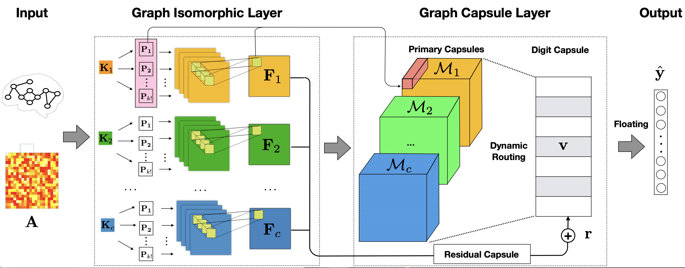
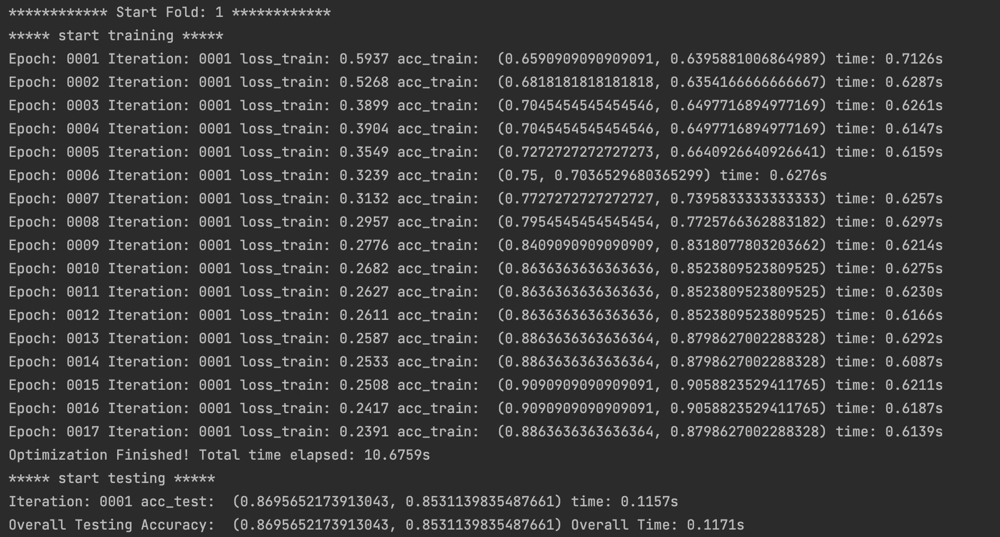

# Iso-CapsNet



## Iso-CapsNet: Isomorphic Capsule Network for Brain Graph Representation Learning 

Paper URL at arXiv: https://arxiv.org/abs/2206.13465

### Two other papers are helpful for readers to follow the ideas in this paper and the code

(1) IsoNN: Isomorphic Neural Network for Graph Representation Learning and Classification https://arxiv.org/abs/1907.09495

(2) Dynamic Routing Between Capsules https://arxiv.org/abs/1710.09829

### Graph Neural Networks from IFM Lab

The latest graph neural network models proposed by IFM Lab can be found via the following link<br>
IFM Lab GNNs: https://github.com/jwzhanggy/IFMLab_GNN

### References

```
@article{Zhang2022IsoCapsNetIC,
  title={Iso-CapsNet: Isomorphic Capsule Network for Brain Graph Representation Learning},
  author={Jiawei Zhang},
  journal={ArXiv},
  year={2022},
  volume={abs/2206.13465}
}
```

************************************************************************************************

## How to run the code?

### To run a script, you can just use command line: python3 script_name.py

After downloading the code, you can run
```
python3 script_isocapsnet.py
```
directly for brain graph classification on the HIV_fMRI dataset. 

### What are the scripts used for?

(1) script_isocapsnet.py for brain graph classification and model training/testing. You can adjust the dataset names and the corresponding hyper-parameters to run experiments Iso-CapsNet on the four brain graph benchmark datasets. 


### Several toolkits may be needed to run the code
(1) pytorch (https://anaconda.org/pytorch/pytorch) <br>
(2) sklearn (https://anaconda.org/anaconda/scikit-learn) <br>


************************************************************************************************

## Organization of the code?

A simpler template of the code is also available at http://www.ifmlab.org/files/template/IFM_Lab_Program_Template_Python3.zip

### The whole program is divided into five main parts:

(1) data.py (for data loading and basic data organization operators, defines abstract method load() )

(2) method.py (for complex operations on the data, defines abstract method run() )

(3) result.py (for saving/loading results from files, defines abstract method load() and save() )

(4) evaluate.py (for result evaluation, defines abstract method evaluate() )

(5) setting.py (for experiment settings, defines abstract method load_run_save_evaluate() )

The base class of these five parts are defined in ./code/base_class/, they are all abstract class defining the templates and architecture of the code.

The inherited class are provided in ./code, which inherit from the base classes, implement the abstract methonds.

## Detailed information on funtional classes?

### a. data

(1) Dataset_Loader_Batch.py (for dataset loading from the ./data/folders)


### b. method

#### b-1 Iso-CapsNet Model for Brain Graph Classification

(1) Method_IsoCapsNet.py (the Iso-CapsNet training/testing for brain graph classification)

#### b-2 Iso-CapsNet basics

(1) Method_IsoCapsNet_Modules.py (basic building components of Iso-CapsNet)

### c. result

(1) Result_Saving.py (for saving results to file)


### d. evaluate

(1) EvaluateAcc.py (accuracy metric)


### e. setting

(1) Settings.py (defines the interactions and data exchange among the above classes)

************************************************************************************************

## Learning results of Iso-CapsNet on HIV_fMRI.




************************************************************************************************
